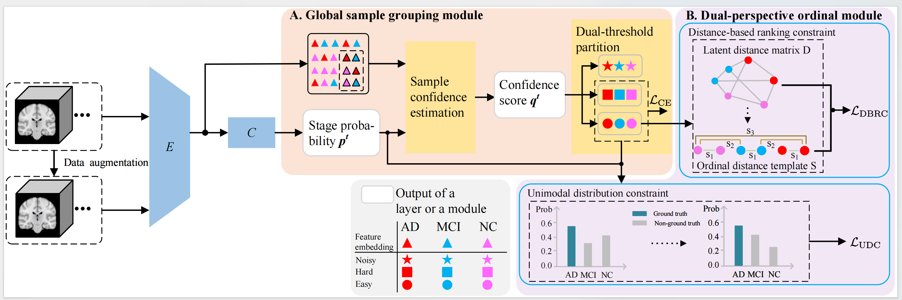
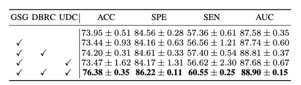
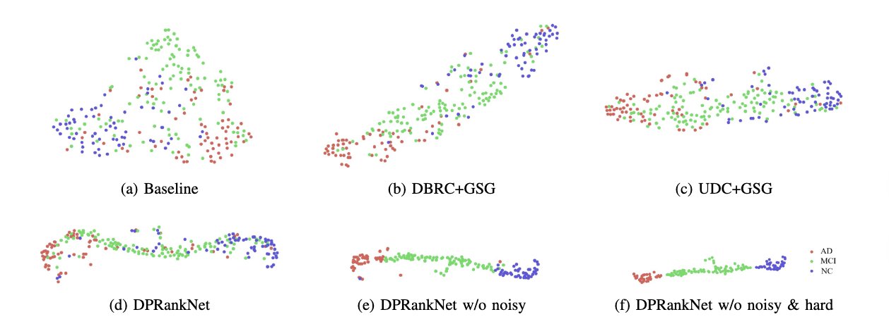
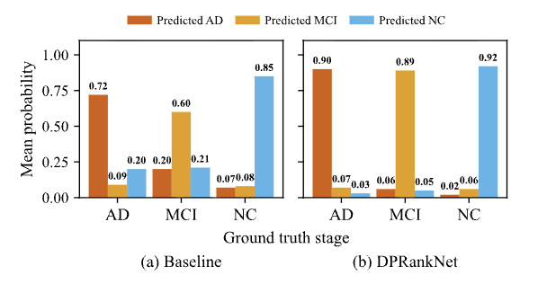
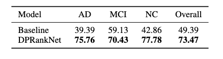
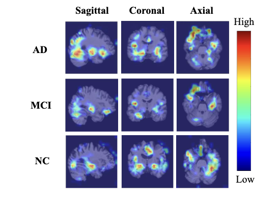
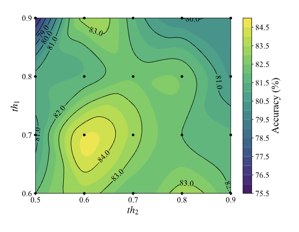

# DPRankNet: Anchoring Global Disease Trajectories via Difficulty-Aware Dual-Perspective Ranking for Alzheimer's Disease Staging

*Authors: L. Gao, J. Dai, X. Wang et al.*

## Table of Contents

1. [Introduction](#introduction)
2. [Results](#results)
3. [Get Started](#getstarted)

## Introduction <a name="introduction"></a>

Accurate staging along the Normal Control (NC) \(\!\rightarrow\) Mild Cognitive Impairment (MCI) \(\!\rightarrow\) Alzheimer's Disease (AD) continuum is vital for timely intervention. Structural magnetic resonance imaging (sMRI) enables early detection by revealing brain tissue changes before clinical symptoms manifest. However, existing sMRI-based methods often rely on pointwise classification or local pairwise comparisons, limiting their ability to capture global disease progression.
We propose DPRankNet, a difficulty-aware dual-perspective ranking framework that anchors feature learning within the global disease trajectory. DPRankNet introduces two key components: 1) a Global Sample Grouping (GSG) module, which dynamically partitions data into easy, hard, and noisy subsets based on sample characteristics and neighborhood context, ensuring that easy samples provide stable optimization anchors for the disease trajectory, while hard samples refine learning at ambiguous clinical boundaries; and 2) a Dual-Perspective Ordinal (DPO) module, which enforces global NC\(\!\rightarrow\)MCI\(\!\rightarrow\)AD progression by simultaneously regularizing the latent geometry via a distance-based ranking constraint and the decision space via a unimodal-distribution constraint. This ensures that both feature embeddings and predicted probabilities strictly adhere to the biological ordinality of neurodegeneration. Experimental results demonstrate the superiority of DPRankNet, achieving state-of-the-art accuracy of 76.38\% on the internal ADNI dataset and robust generalization with 76.31\% accuracy on the external AIBL cohort. Extensive evaluations show  enhanced intra-class compactness and inter-class separation, with  predicted probabilities following a single-peaked distribution centered on the ground-truth stage. Further feature visualization  confirms alignment with  disease progression, and interpretability assessments indicate the model  effectively focuses on clinically established biomarkers. Our proposed framework is depicted as below.



## Model Implementations and Weights <a name="models"></a>

To assess the reliability and robustness of DPRankNet, we employ 5-fold cross-validation for all experiments. We repeat the 5-fold cross-validation process three times and calculate the mean and standard deviation of the validation set outcomes as the final results.Below are the sections containing the code for different experimental models:

1.[Code for DPRankNet Model](./train/main_dual.py)


2.[Model Weights for DPRankNet](./weights/)


## Results <a name="results"></a>

### 1.Comparison results with state-of-the-art methods


### 2. Evaluation of Feature Space Geometry
We introduce the Distance Ratio (DR), a relative scale-invariant measure designed to assess the geometric quality of the latent space.


### 3. Ablation Study



### 4. t-SNE visualization 
The red, green, and blue points represent AD, MCI, and NC subjects, respectively.



### 5. Analysis of Predicted Probability Distributions

To evaluate UDC’s effect on decision-making, we analyze the mean predicted probability distributions and the unimodal rate. 





### 6. Network interpretability visualization using gradient-weighted class activation map (Grad-CAM). 
The colorbar reflects the levels of attention that our DPRankNet allocates to different brain regions during label prediction. Red signifies regions where DPRankNet focuses more attention, blue denotes regions of lesser attention, and the gradual change from blue to red represents increasing levels of attention paid by DPRankNet. The three lines from top to bottom display slices from sMRI images labeled as AD, MCI, and NC, respectively, each accompanied by its individual heatmaps. The first, middle, and last columns show the slices of each sMRI image from sagittal, coronal, and transaxial views, respectively.



### 7. Hyperparameter Sensitivity Analysis

Hyperparameter sensitivity analysis of the GSG module. The contour plot shows the impact of partitioning thresholds ($th_1$ and $th_2$) on classification accuracy.



## Get Started <a name="getstarted"></a>

### 1. Downloading datasets from ADNI path.

All sMRI images are screened at the baseline timepoint using 1.5T scanners following the T1-weighted MPRAGE protocol. Table I presents the demographic and clinical information of these subjects. The website is [ADNI](https://adni.loni.usc.edu/).

### 2. Data preprocessing

For data preprocessing, we adopt the pipeline involving skull stripping, dura and neck removal, and affine registration using the tool of [FMRIB](https://fsl.fmrib.ox.ac.uk/). The affine registration aligns all sMRI images with the MNI152 template. Subsequently, we normalize all the sMRI images with the dimensions 160 × 160 × 160. Finally, we normalize the voxel values of all the sMRI image into the range 0 to 1.
Next, generate a CSV file containing the paths of all brain images, along with their corresponding labels (e.g., 0 for AD, 1 for MCI, 2 for NC).

### 3. Training code.

```python
python main_dual.py
```

### 4. Testing code.

```python
python predict.py
```

### 6. Folder structure

```python
DPRankNet_codes
   ├─ figures
   │  ├─ distance_sample.py
   │  ├─ grad_cam.py
   │  ├─ resnet_list.py
   │  ├─ thresholds.py
   │  └─ tsne.py
   ├─ test
   │  ├─ dataloder_predict.py
   │  ├─ predict.py
   │  └─ resnet_select.py
   └─ train
      ├─ dataloder_adni.py
      ├─ main_dual.py
      └─ resnet_select.py
```

### Acknowledgments

We gratefully thank the **ADNI**  investigators for providing access to the data.